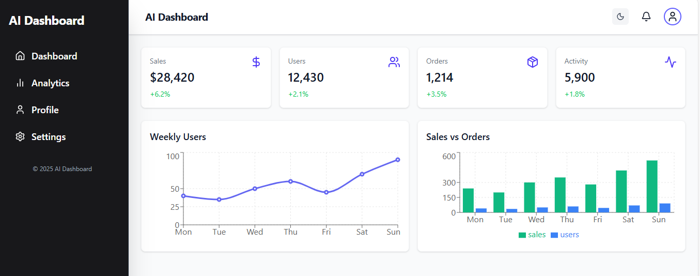

AI Dashboard (Work in Progress)

An interactive and modern dashboard built with React + TypeScript, Tailwind CSS, and Recharts.
This project is currently under active development and aims to showcase AI-powered insights and analytics in a clean, responsive UI.

🚀 Features (Planned & In Progress)

📊 Data Visualization with charts and graphs using Recharts

📂 Sidebar Navigation with collapsible menus

🌗 Dark/Light Mode Toggle for better accessibility

📱 Responsive Layout for desktop and mobile

⚡ Type-safe Development with TypeScript

🛠️ Tech Stack

React (TypeScript)

Tailwind CSS

Recharts

JavaScript/TypeScript (ESNext)

📌 Status

This is a Work in Progress (WIP). Features are being added and improved regularly.
Follow the repository for updates.

📷 Preview

📜 License

This project is open-source and available under the MIT License.